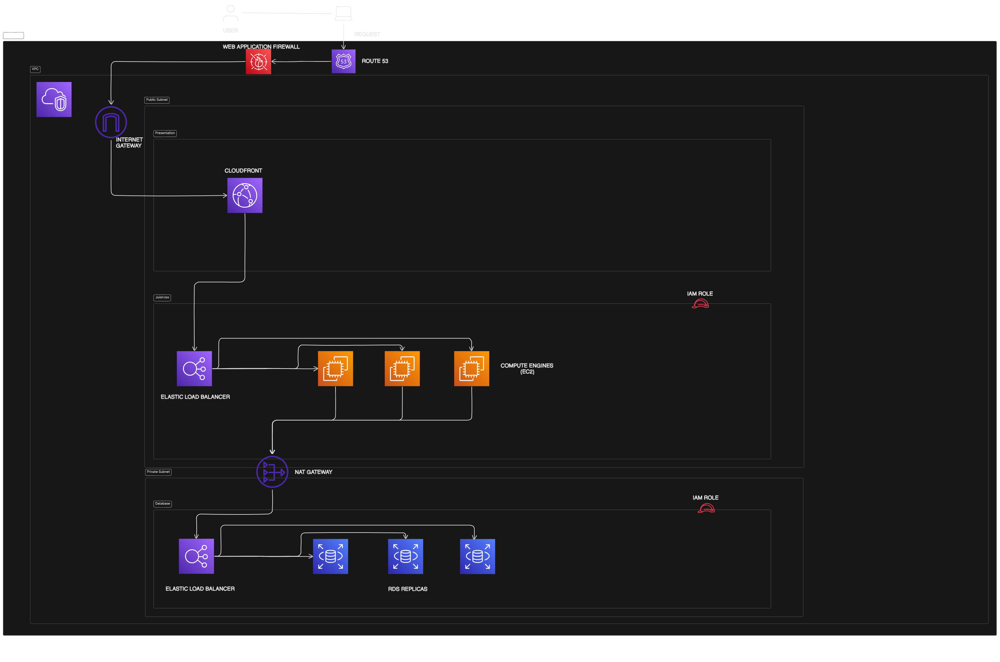

# Three-Tier Application Architecture on AWS Cloud

This document provides a comprehensive overview of a three-tier application architecture deployed on the AWS Cloud. This architecture is a standard and scalable way to build and deploy web applications.

## Understanding a Three-Tier Architecture

A three-tier architecture divides an application into three logical and physical computing tiers:

1.  **Presentation Tier (CloudFront / S3):** This is the user interface and the part of the application that the end-users interact with. It's responsible for displaying data to the user and collecting user input. In our AWS architecture, this tier is handled by Amazon S3 for hosting static web content and Amazon CloudFront as a Content Delivery Network (CDN) to cache content closer to users, reducing latency.

2.  **Business / Logic Tier (EC2 / ECS):** This tier is the core of the application. It contains the business logic, processes user input from the presentation tier, and interacts with the data tier. We use Amazon EC2 instances or Amazon Elastic Container Service (ECS) to run the application code. This tier is placed in private subnets to protect it from direct internet access.

3.  **Database Tier (RDS):** This tier is responsible for storing and managing the application's data. It consists of a database system. In our architecture, we use Amazon Relational Database Service (RDS), which is a managed database service that makes it easy to set up, operate, and scale a relational database in the cloud. For high availability and fault tolerance, we use RDS replicas. This tier is also placed in private subnets to ensure it's not exposed to the internet.

## AWS Services Used

The following AWS services are used to build this three-tier architecture:

1.  **VPC (Virtual Private Cloud):** Provides an isolated section of the AWS Cloud.
    *   **Subnets:** We use public and private subnets to isolate our resources.
    *   **Internet Gateway:** Allows communication between the VPC and the internet.
    *   **NAT Gateways:** Enable instances in private subnets to connect to the internet or other AWS services, but prevent the internet from initiating a connection with those instances.
    *   **Route Tables:** A set of rules, called routes, that are used to determine where network traffic is directed.

2.  **Elastic Load Balancer (ELB):** Automatically distributes incoming application traffic across multiple targets, such as EC2 instances.

3.  **Auto Scaling Groups:** Helps to ensure that you have the correct number of Amazon EC2 instances available to handle the load for your application.

4.  **CloudFront:** A fast content delivery network (CDN) service that securely delivers data, videos, applications, and APIs to customers globally with low latency and high transfer speeds.

5.  **EC2 / ECS:** The compute resources for running the application logic.

6.  **RDS:** A managed relational database service.

7.  **Route 53:** A scalable and highly available Domain Name System (DNS) web service.

8.  **WAF (Web Application Firewall):** Helps protect your web applications or APIs against common web exploits that may affect availability, compromise security, or consume excessive resources.

9.  **IAM (Identity and Access Management):** Enables you to manage access to AWS services and resources securely.

## Architecture Diagram

Here is the visual representation of the three-tier architecture:

## Security Enhancements

Security is a critical aspect of any application. Here’s how we enhance the security of our architecture:

### IAM Roles

IAM roles are a secure way to grant permissions to entities that you trust. Instead of sharing long-term credentials, we use IAM roles to provide temporary credentials to our EC2 instances and other AWS services. This follows the principle of least privilege, where we only grant the necessary permissions for a service to perform its task. For example, an EC2 instance might have a role that allows it to read from an S3 bucket but not write to it.

### Web Application Firewall (WAF) for Route Security

While IAM roles secure access to AWS services, we need to protect our application from external threats at the network edge. This is where AWS WAF comes in.

A common interview question is: "Apart from IAM roles, how can you add another layer of security, especially for your application's routes?"

The answer is to use AWS WAF. As shown in the architecture diagram, we can place a WAF in front of our application. The traffic flow would be:

`User -> Route 53 -> WAF -> CloudFront -> ELB -> EC2 Instances`

By integrating WAF with CloudFront (or an Application Load Balancer), we can protect our application against common web exploits like SQL injection and cross-site scripting (XSS). WAF allows you to create custom rules to filter and monitor HTTP/HTTPS requests, giving you granular control over the traffic that reaches your application. This provides a robust security posture for your application's public-facing endpoints.
